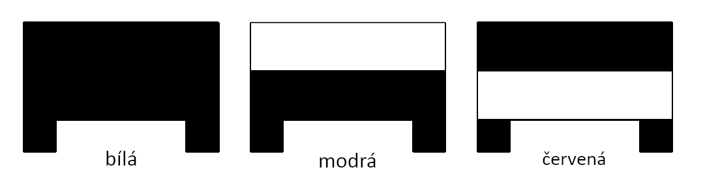

<h1>Automatizovaný sklad pomocí PLC</h1>
Jedná se o automatický vysokozdvižný sklad, který dokáže třídit palety dle čárového kódu. Pracovníci pouze kontrolují, že stroj pracuje správně a mačkají tlačítka při vkládání barevných obrobků. Model skladu je 
 
<h2>Použité součástky</h2>
<h4>Programovatelný automat</h4>
<i>Automat je vybaven základním modulem – procesorem CP-1014 a rozšiřující moduly IB-1301 a OS-1401.</i>
 
<h4>Stejnosměrné motory</h4>
<i>Dva motory se snímači a dva bez snímače. Všechny motory jsou spínány dvojící relé.</i>
 
<h4>Inkrementální snímače</h4>
<i>Tyto snímače jsou hlavní výsadou skladu, využívá se jich při pohybu mezi jednotlivými částmi regálu a při pohybu s paletou do nákladací oblasti.  </i>
 
<h4>Koncové spínače</h4>
<i>První koncový spínač se nachází na vertikální ose a druhý na horizontální. Ty jsou určeny převážně pro kalibrační potřeby. Další dva spínače jsou použity na výsuvném rameni podavače. Ty jsou určeny pro určení, jestli je rameno plně vysunuté, nebo plně zatažené.</i>
 
<h4>Infračervené senzory</h4>
<i>Slouží pro identifikaci černé stopy na bílém pozadí. Jedná se fakticky o čárový kód.</i>

<h4>Světelné závory</h4>
<i>Dvojice těchto závor se používá v nakládací oblasti. Pomocí jejich výstupních hodnot se určuje, v závislosti na dalších podmínkách, jestli se přepravník oblasti pohybuje směrem dovnitř nebo ven.</i>
 
<h2>Software</h2>
V tomto projektu je použitý jazyk Structured Text. -DOPLNIT- 
 
<h2>Zapojení</h2>
-DOPLNIT- 
 
<h2>License</h2>
-DOPLNIT- 
