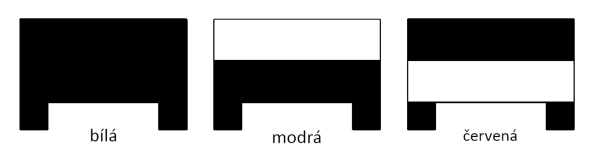
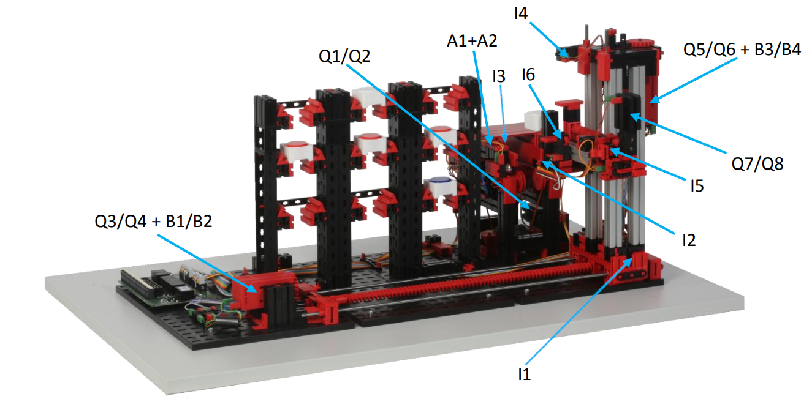

<h1>Automatizovaný sklad pomocí PLC</h1>

    
    

<i>Jedná se o automatický vysokozdvižný sklad, který dokáže třídit palety dle čárového kódu. Pracovníci pouze kontrolují, že stroj pracuje správně a mačkají tlačítka při vkládání barevných obrobků. Model skladu je -DOPLNIT- </i>
 
<h2>Použité součástky</h2>
<h4>Programovatelný automat</h4>
Automat je vybaven základním modulem – procesorem CP-1014 a rozšiřující moduly IB-1301 a OS-1401.
 
<h4>Stejnosměrné motory</h4>
Dva motory se snímači a dva bez snímače. Všechny motory jsou spínány dvojící relé.
 
<h4>Inkrementální snímače</h4>
Tyto snímače jsou hlavní výsadou skladu, využívá se jich při pohybu mezi jednotlivými částmi regálu a při pohybu s paletou do nákladací oblasti.
 
<h4>Koncové spínače</h4>
První koncový spínač se nachází na vertikální ose a druhý na horizontální. Ty jsou určeny převážně pro kalibrační potřeby. Další dva spínače jsou použity na výsuvném rameni podavače. Ty jsou určeny pro určení, jestli je rameno plně vysunuté, nebo plně zatažené.
 
<h4>Infračervené senzory</h4>
Slouží pro identifikaci černé stopy na bílém pozadí. Jedná se fakticky o čárový kód.

<h4>Světelné závory</h4>
Dvojice těchto závor se používá v nakládací oblasti. Pomocí jejich výstupních hodnot se určuje, v závislosti na dalších podmínkách, jestli se přepravník oblasti pohybuje směrem dovnitř nebo ven.
 
<h2>Software</h2>
V tomto projektu je použitý jazyk Structured Text. -DOPLNIT- 
 
<h2>Zapojení</h2>
 
<table>
  <thead>
    <tr>
      <th style="text-align:center">číslo pinu</th>
      <th style="text-align:center">vstup/výstup</th>
      <th style="text-align:center">jednotka</th>
      <th style="text-align:center">bit číslo</th>
      <th style="text-align:center">D9 konektor pin č.</th>
      <th style="text-align:center">popis</th>
    </tr>
  </thead>
  <tbody>
    <tr>
      <td style="text-align:center">1</td>
      <td style="text-align:center">"+"</td>
      <td style="text-align:center"></td>
      <td style="text-align:center">hnědá</td>
      <td style="text-align:center">4, 5</td>
      <td style="text-align:center">Zdroj + 24 V pro akční členy</td>
    </tr>
    <tr>
      <td style="text-align:center">2</td>
      <td style="text-align:center">"+"</td>
      <td style="text-align:center"></td>
      <td style="text-align:center">zelená</td>
      <td style="text-align:center">4, 5</td>
      <td style="text-align:center">Zdroj + 24 V pro senzory</td>
    </tr>
    <tr>
      <td style="text-align:center">3</td>
      <td style="text-align:center">"-"</td>
      <td style="text-align:center"></td>
      <td style="text-align:center">modrá</td>
      <td style="text-align:center">1, 2</td>
      <td style="text-align:center">0 V</td>
    </tr>
    <tr>
      <td style="text-align:center">4</td>
      <td style="text-align:center">"-"</td>
      <td style="text-align:center"></td>
      <td style="text-align:center">modrá</td>
      <td style="text-align:center">1, 2</td>
      <td style="text-align:center">0 V</td>
    </tr>
    <tr>
      <td style="text-align:center">5</td>
      <td style="text-align:center">I1</td>
      <td style="text-align:center">IB1301</td>
      <td style="text-align:center">4–šedá</td>
      <td style="text-align:center">DI3/9</td>
      <td style="text-align:center">koncový spínač horizontální osy</td>
    </tr>
    <tr>
      <td style="text-align:center">6</td>
      <td style="text-align:center">I2</td>
      <td style="text-align:center">IB1301</td>
      <td style="text-align:center">5-fialová</td>
      <td style="text-align:center">DI3/8</td>
      <td style="text-align:center">světelná brána "dovnitř"</td>
    </tr>
    <tr>
      <td style="text-align:center">7</td>
      <td style="text-align:center">I3</td>
      <td style="text-align:center">IB1301</td>
      <td style="text-align:center">6–modrá</td>
      <td style="text-align:center">DI3/7</td>
      <td style="text-align:center">světelná brána "ven"</td>
    </tr>
    <tr>
      <td style="text-align:center">8</td>
      <td style="text-align:center">I4</td>
      <td style="text-align:center">IB1301</td>
      <td style="text-align:center">7–zelená</td>
      <td style="text-align:center">DI3/6</td>
      <td style="text-align:center">koncový spínač vertikální osy</td>
    </tr>
    <tr>
      <td style="text-align:center">9</td>
      <td style="text-align:center">A1</td>
      <td style="text-align:center">CP1014</td>
      <td style="text-align:center">4–šedá</td>
      <td style="text-align:center">DI1/9</td>
      <td style="text-align:center">IR senzor pohybu dolní – pulzy 1…na analog. vstup</td>
    </tr>
    <tr>
      <td style="text-align:center">10</td>
      <td style="text-align:center">A2</td>
      <td style="text-align:center">CP1014</td>
      <td style="text-align:center">5–fialová</td>
      <td style="text-align:center">DI1/8</td>
      <td style="text-align:center">IR senzor pohybu horní – pulzy 2…na analog. vstup</td>
    </tr>
    <tr>
      <td style="text-align:center">11</td>
      <td style="text-align:center">B1</td>
      <td style="text-align:center">IB1301</td>
      <td style="text-align:center">0–šedá</td>
      <td style="text-align:center">DI2/9</td>
      <td style="text-align:center">kodér – horizontální osa … pulzy 1</td>
    </tr>
    <tr>
      <td style="text-align:center">12</td>
      <td style="text-align:center">B2</td>
      <td style="text-align:center">IB1301</td>
      <td style="text-align:center">1–fialová</td>
      <td style="text-align:center">DI2/8</td>
      <td style="text-align:center">kodér – horizontální osa … pulzy 2</td>
    </tr>
    <tr>
      <td style="text-align:center">13</td>
      <td style="text-align:center">B3</td>
      <td style="text-align:center">IB1301</td>
      <td style="text-align:center">2–modrá</td>
      <td style="text-align:center">DI2/7</td>
      <td style="text-align:center">kodér – vertikální osa … pulzy 1</td>
    </tr>
    <tr>
      <td style="text-align:center">14</td>
      <td style="text-align:center">B4</td>
      <td style="text-align:center">IB1301</td>
      <td style="text-align:center">3–zelená</td>
      <td style="text-align:center">DI2/6</td>
      <td style="text-align:center">kodér – vertikální osa … pulzy 2</td>
    </tr>
    <tr>
      <td style="text-align:center">15</td>
      <td style="text-align:center">I5</td>
      <td style="text-align:center">CP1014</td>
      <td style="text-align:center">6–modrá</td>
      <td style="text-align:center">DI1/7</td>
      <td style="text-align:center">koncový spínač nosný článek (krakorec) dopředu</td>
    </tr>
    <tr>
      <td style="text-align:center">16</td>
      <td style="text-align:center">I6</td>
      <td style="text-align:center">CP1014</td>
      <td style="text-align:center">7–zelená</td>
      <td style="text-align:center">DI1/6</td>
      <td style="text-align:center">koncový spínač nosný článek (krakorec) zpět</td>
    </tr>
    <tr>
      <td style="text-align:center">17</td>
      <td style="text-align:center">Q1 (M1)</td>
      <td style="text-align:center">OS1401</td>
      <td style="text-align:center">4-žlutá</td>
      <td rowspan="9" style="padding 8px;">8 datových bitů, „+“ zdroje pro periferie, „+“ zdroje systémového a zem</td>
      <td style="text-align:center">motor dopravníku vpřed</td>
    </tr>
    <tr>
      <td style="text-align:center">18</td>
      <td style="text-align:center">Q2 (M1)</td>
      <td style="text-align:center">OS1401</td>
      <td style="text-align:center">5–růžová</td>
      <td style="text-align:center">motor dopravníku vzad</td>
    </tr>
    <tr>
      <td style="text-align:center">19</td>
      <td style="text-align:center">Q3 (M2)</td>
      <td style="text-align:center">OS1401</td>
      <td style="text-align:center">6–červená</td>
      <td style="text-align:center">motor horizontálního posuvu směrem k policím</td>
    </tr>
    <tr>
      <td style="text-align:center">20</td>
      <td style="text-align:center">Q4 (M2)</td>
      <td style="text-align:center">OS1401</td>
      <td style="text-align:center">7–hnedá</td>
      <td style="text-align:center">motor horizontálního posuvu směrem k dopravníku</td>
    </tr>
    <tr>
      <td style="text-align:center">21</td>
      <td style="text-align:center">Q5 (M3)</td>
      <td style="text-align:center">OS1401</td>
      <td style="text-align:center">8–černá</td>
      <td style="text-align:center">motor vertikálního posuvu dolů</td>
    </tr>
    <tr>
      <td style="text-align:center">22</td>
      <td style="text-align:center">Q6 (M3)</td>
      <td style="text-align:center">OS1401</td>
      <td style="text-align:center">9–bílá</td>
      <td style="text-align:center">motor vertikálního posuvu nahoru</td>
    </tr>
    <tr>
      <td style="text-align:center">23</td>
      <td style="text-align:center">Q7 (M4)</td>
      <td style="text-align:center">OS1401</td>
      <td style="text-align:center">10–šedivá</td>
      <td style="text-align:center">motor nosný článek dopředu</td>
    </tr>
    <tr>
      <td style="text-align:center">24</td>
      <td style="text-align:center">Q8 (M4)</td>
      <td style="text-align:center">OS1401</td>
      <td style="text-align:center">11–fialová</td>
      <td style="text-align:center">motor nosný článek zpět</td>
    </tr>
  </tbody>
</table>
<h2>License</h2>
GNU General Public License v3.0
  
©2022 knedl1k
